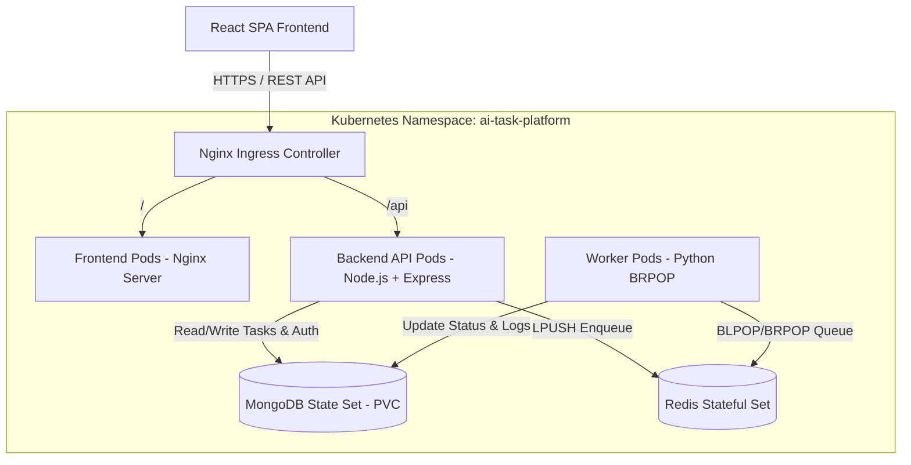
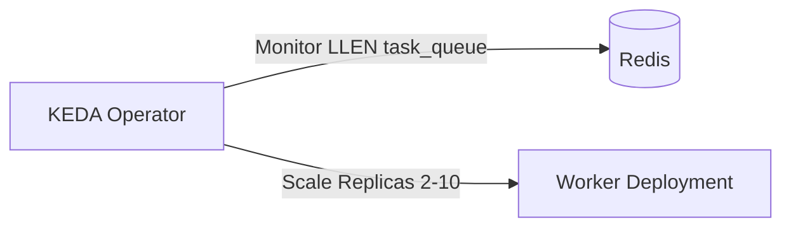

# AI Task Processing Platform — Architecture Documentation

This document describes the system architecture, scaling strategy, database indexing, failure recovery, and deployment methodologies for the production-grade AI Task Processing Platform.

---

## 1. Overall System Architecture

The AI Task Processing Platform utilizes a decoupled microservices architecture designed to support high throughput, asynchronous task execution, and real-time status monitoring.



### Components and Request Lifecycle

1. **Client Layer (React.js)**: A single-page application hosted on Nginx. Communicates with the API server via RESTful endpoints. Utilizes short-polling for tasks in non-final states (`pending` or `running`) to reflect progress instantly in the UI.
2. **Routing Layer (Nginx Ingress)**: Handles reverse proxying and SSL termination. Maps incoming HTTP requests to corresponding services: `/api/*` requests route to the backend services, while all other paths route to the static frontend.
3. **Backend API Layer (Node.js + Express)**: A lightweight, stateless REST API server that manages authentication (bcrypt + JWT), handles API rate limiting (Helmet + express-rate-limit), creates task records in MongoDB, and enqueues task payloads into Redis.
4. **Queue Layer (Redis)**: An in-memory queue structured as a Redis List (`task_queue`). It acts as a buffer between the API servers and background processors.
5. **Background Processing Layer (Python Worker)**: Independent, stateless worker daemons that block-consume (`BRPOP`) messages from Redis, perform operations (string manipulation, word counts), and write logs/results directly to MongoDB.
6. **Persistence Layer (MongoDB)**: Scalable document store containing collection schemas for `Users` and `Tasks`.

---

## 2. Worker Scaling Strategy

To ensure optimal resource utilization and task processing latencies, the Python worker service is scaled dynamically.

### Horizontal Pod Autoscaling (HPA)
The platform deploys a Kubernetes `HorizontalPodAutoscaler` for worker pods. The scaling strategy is defined in two tiers:

1. **CPU-based Scaling (Standard)**:
   - Workers are allocated `100m` CPU request and `250m` CPU limit.
   - HPA is configured to trigger autoscaling when average CPU utilization across the worker deployment exceeds **70%**.
   - Min Replicas: `2` (High availability across nodes).
   - Max Replicas: `10`.

2. **Queue-Depth Scaling (Advanced / Production Upgrade)**:
   - For a production deployment, standard HPA is supplemented with **KEDA (Kubernetes Event-driven Autoscaling)**.
   - KEDA monitors the Redis list length (`task_queue`).
   - If the queue depth exceeds **50 pending tasks**, KEDA immediately spins up additional worker pods (up to 10), bypassing standard CPU metric delays.



---

## 3. Handling High Task Volume (100,000 tasks/day)

Processing 100,000 tasks per day equates to an average of **1.16 tasks per second (TPS)**. However, production systems must design for peak loads (e.g., 5x average = **6 TPS**). The architecture handles this volume through the following mechanisms:

### System Capacity and Throughput Calculations
- **Average Execution Time**: ~1.1 seconds (1s simulated execution time + 0.1s database overhead).
- **Single Worker Capacity**: A single worker thread can process ~0.9 tasks/sec.
- **Minimum Replica Count**: 2 workers provide ~1.8 tasks/sec capacity.
- **Peak Capacity Requirement**: To handle peak load of 6 TPS, the system auto-scales to `ceil(6 / 0.9) = 7` worker pods.

### High Volume Optimizations
- **Non-blocking I/O**: The Node.js API server handles client requests asynchronously. It does not wait for worker execution; it returns a `201 Created` immediately after enqueuing the task in Redis (~5ms response time).
- **MongoDB Connection Pooling**: The Node.js and Python services use connection pooling (Mongoose/pymongo defaults) to reuse TCP connections rather than opening new connections per request/task.
- **Redis Multiplexing**: Redis performs single-threaded in-memory operations and easily supports up to 100,000 operations per second, making it a zero-overhead queue broker for this load.

---

## 4. MongoDB Indexing Strategy

Unindexed queries on large collections lead to collection scans, high CPU utilization, and slow response times. With 100,000 tasks per day, the `tasks` collection will grow by 3 million records monthly. We implement the following indexing strategy:

| Collection | Index Definition | Index Type | Query Target | Rationale |
| :--- | :--- | :--- | :--- | :--- |
| `users` | `{ email: 1 }` | Single Field / Unique | User login and registration check | Prevents duplicate user creation and speeds up authentication lookups. |
| `tasks` | `{ userId: 1, status: 1, createdAt: -1 }` | Compound | Fetching a user's task list (filtered by status, sorted by date) | Optimizes the Dashboard API query. Allows the database to resolve sorting and filtering inside the index tree without loading documents in memory. |
| `tasks` | `{ createdAt: 1 }` | TTL Index (Optional) | Data retention pruning | Automatically purges task records older than 30 days to limit disk utilization (3M tasks/month). |

---

## 5. Redis Failure Handling and Recovery Strategy

Because Redis is the bridge between the API and workers, its availability is critical. The platform implements a multi-tiered resilience strategy:

### 1. Data Persistence (RDB + AOF)
To prevent task loss on container restart:
- **AOF (Append Only File)**: Configured with `appendfsync everysec`. Redis logs every write operation to disk once per second. Maximum data loss in a crash is capped at 1 second of transactions.
- **RDB (Redis Database snapshots)**: Scheduled backups taken every 15 minutes as secondary disaster recovery files.

### 2. Client Resilience (Node.js & Python)
- **Automatic Reconnections**: `ioredis` and `redis-py` are configured with exponential backoff retry strategies (max retries = 10, initial delay = 1s, doubling up to 15s).
- **Graceful Failover**: If Redis is completely offline, the API server returns a `503 Service Unavailable` with details from the `/readyz` probe, preventing corrupt task records from piling up in MongoDB.

### 3. Dead Letter Queue (DLQ)
- If a task causes a worker to crash repeatedly (e.g., poison-pill payload), the worker catches the error, increments a retry counter, and on the 3rd failure, redirects the task to a `task_queue_dlq` list for administrator inspection.

---

## 6. Deployment Strategy

The system uses a GitOps Git-flow release structure managed by Argo CD.

```
[Developer Branch] ---> Pull Request ---> [main Branch]
                                              |
                                     GitHub Actions (CI/CD)
                                              |
                                    Update Infra Manifests
                                              |
                                    Argo CD Auto-Sync
                                              |
                                  [k3s Cluster Namespace]
```

### Staging Environment
- **Trigger**: Automatic deployment on commits merged to the `develop` branch.
- **CI/CD Workflow**: Builds images tagged as `staging-latest` and `staging-<git-sha>`, pushes to registry, and updates the staging manifests in the infra repository.
- **Synchronization**: Argo CD automatically detects the tag update and deploys using a **Rolling Update** strategy (maxUnavailable: 25%, maxSurge: 25%) ensuring zero-downtime deployments.

### Production Environment
- **Trigger**: Deployment triggered on release tags (e.g., `v2.1.0`) merged to the `main` branch.
- **CI/CD Workflow**: Builds production-ready images, pushes them to the registry, and updates the production folder manifests in the infra repository.
- **Synchronization**: Manual approval or automated sync with a **Recreate** or canary-gated deploy.
- **High Availability configuration**: MongoDB and Redis are deployed as replication stateful sets. Backend API and Frontend deployments run with a minimum of 2 replicas across different physical nodes (using `podAntiAffinity`).
